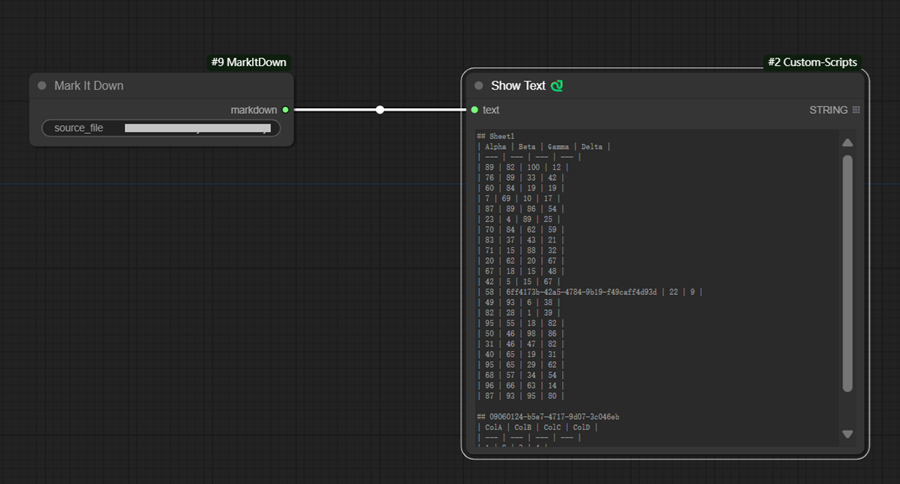
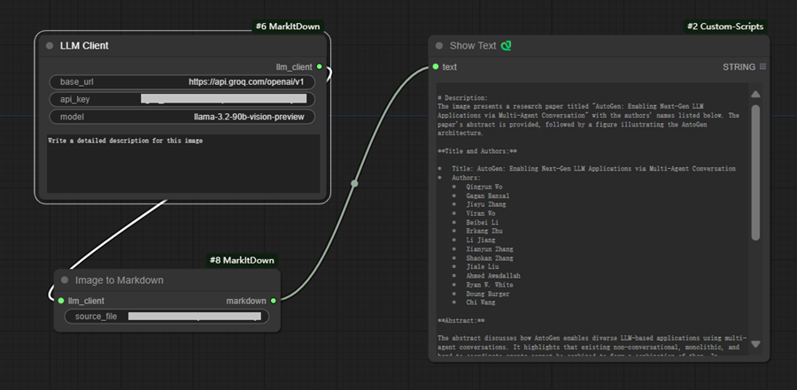

# ComfyUI-MarkItDown

This node pack helps to convert various files to Markdown. It is a Convenient comfyUI wrapper for Microsoft [markitdown](https://github.com/microsoft/markitdown) .

## Custom Nodes

- `MarkItDown` - Convert a file to Markdown. The file can be pdf, pptx, xlsx, docx, htm and html.
- `Image2Markdown` - Convert an image file to Markdown. The file can be jpeg, png, webp, tiff, svg and bmp.
- `LLMClient` - OpenAI API-compitable LLM Client. This node is required by `Image2Markdown` node.

## Sample Workflows

- Convert [data/test.xlsx](data/test.xlsx) to Markdown:

- Convert [data/test.jpg](data/test.jpg) to Markdown with [Groq](https://groq.com/):

## Credits

[MarkItDown](https://github.com/microsoft/markitdown) - Python tool for converting files and office documents to Markdown.

